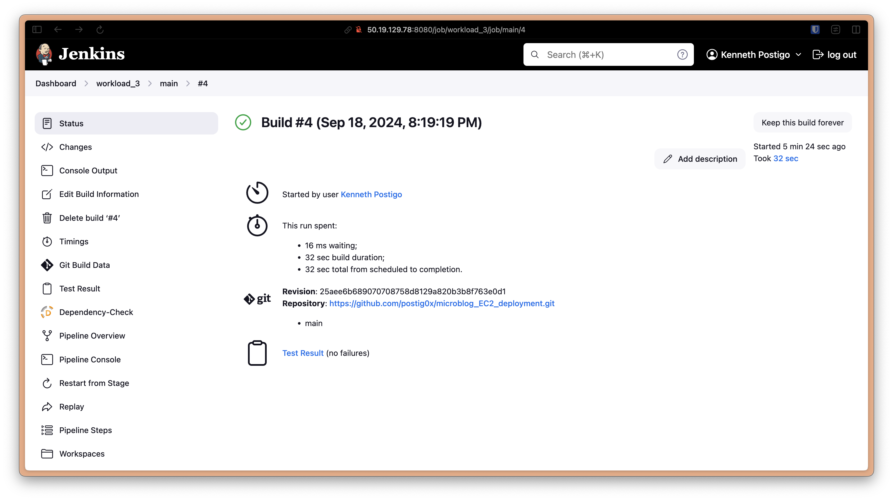
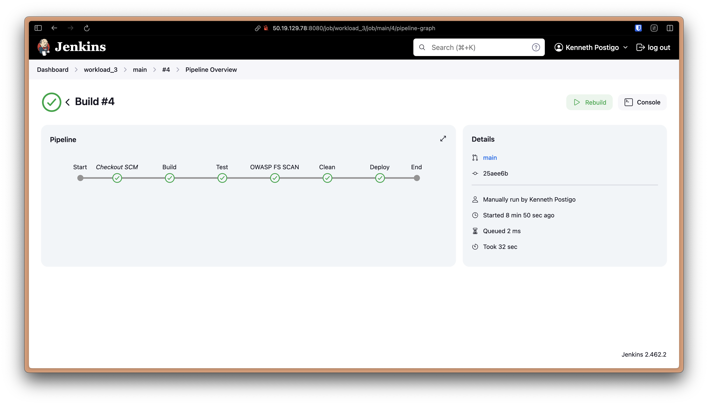
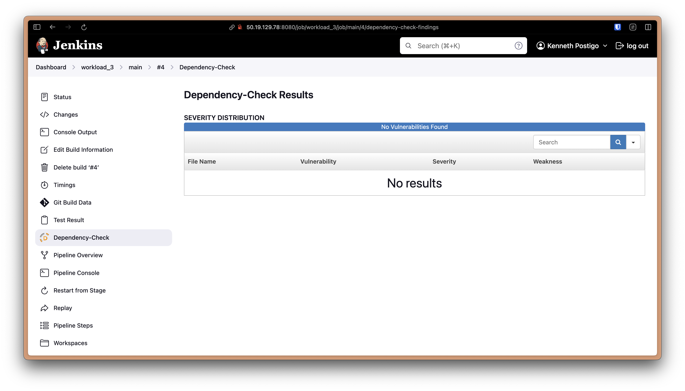
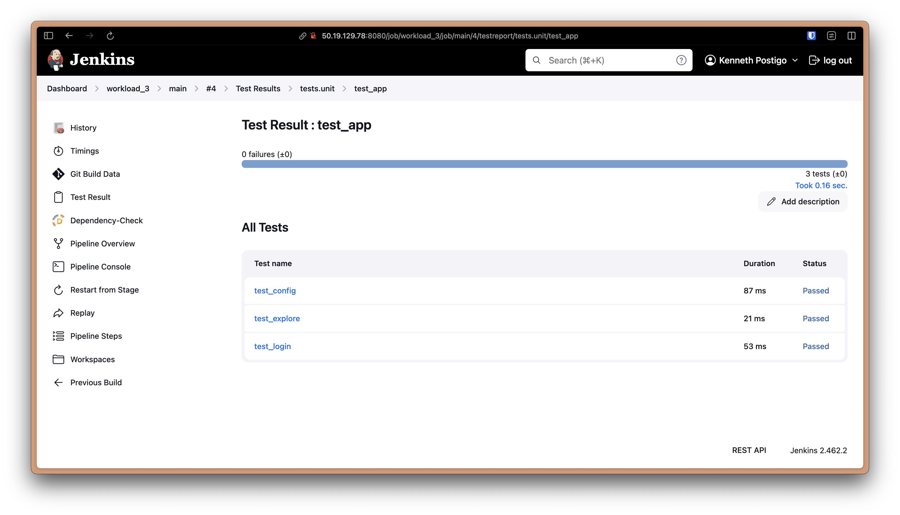
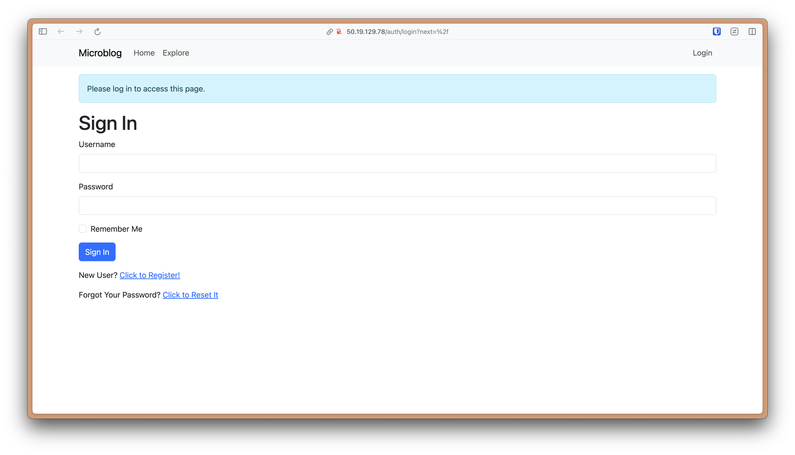
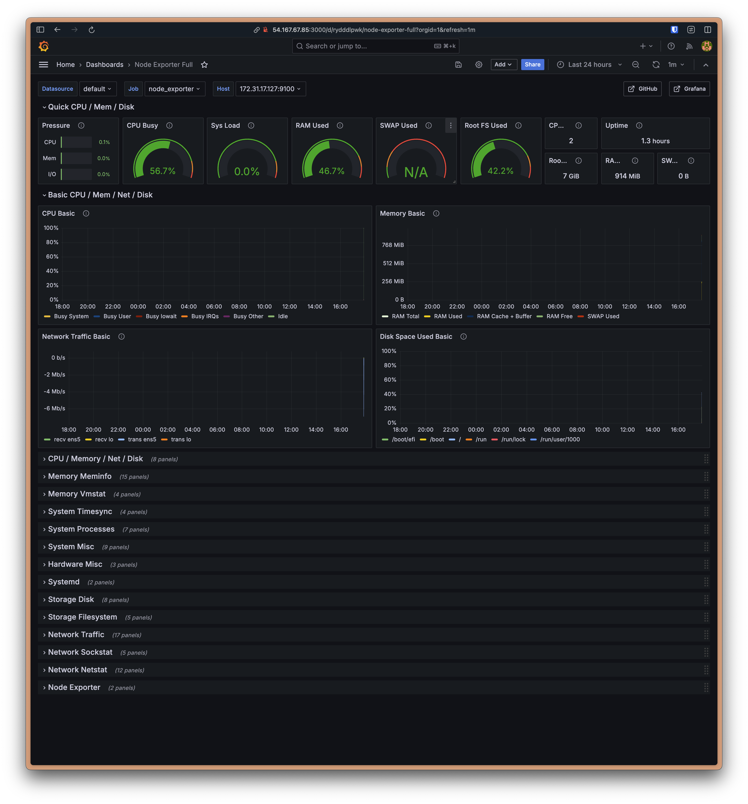
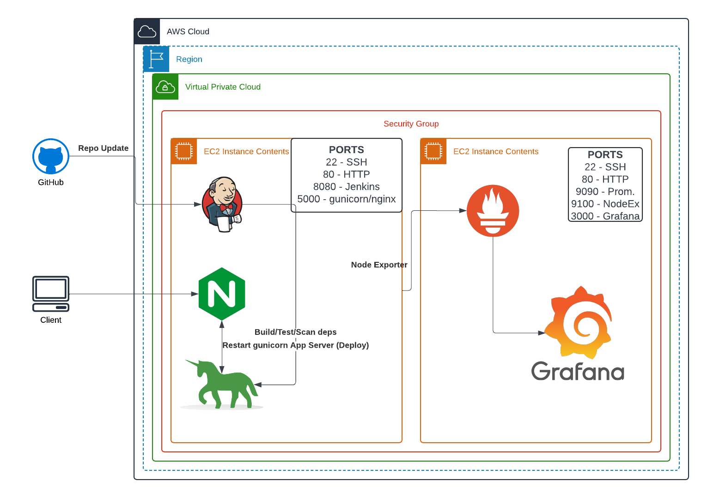

# Microblog EC2 deployment

## Purpose

The purpose of this project is to deploy a microblog web application on an EC2 instance using Jenkins for CI/CD. The goal is to shift from using managed services to provisioning infrastructure manually, allowing for a deeper understanding of the deployment process. This project involves scripting by setting up a Jenkins server, configuring the application environment, and automating the build, test, and deploy stages. This project also includes monitoring the application's activity with Prometheus and Grafana. 

By completing this project, we develop our skills in creating CI/CD pipelines, provisioning infrastructure, and monitoring applications. This helps us further our understanding of the advantages and challenges of self-provisioning resources versus using managed services.

## Steps

1. Launch an EC2 instance named "Jenkins":
	- t3.medium
	- Ubuntu
	- Allow SSH/HTTP
	- Jenkins port 8080
2. Install `python3.9`, `python3.9-venv`, `python3-pip`, and `nginx`, and `jenkins` as shown in the `jenkins_setup.sh` file in this repo.

3. Clone repo into EC2 Jenkins server, cd into project, create and activate a python virtual environment with `python3.9 -m venv venv` and activate the environment with `source venv/bin/activate`

4. Install project dependencies: `pip install -r requirements.txt`

5. Install other packages: `pip install gunicorn pymysql cryptography`

6. Set the Environment variable: `FLASK_APP=microblog.py`

    > This command is setting an environment variable in the server that will be accessed by Flask when it is time to run the application.

7. Set up flask app with `flask translate compile` and `flask db upgrade`

8. Edit NginX config located in `/etc/nginx/sites-enabled/default`:


```
location / {
proxy_pass http://127.0.0.1:5000;
proxy_set_header Host $host;
proxy_set_header X-Forwarded-For $proxy_add_x_forwarded_for;
}
```

> This configuration is setting up a reverse proxy for requests to the root URL `/`. Incoming requests will be forwarded to `http://127.0.0.1:5000`, and each forwarded request will have their `Host` and `X-Forwarded-For` headers modified to be the same as what the client provides. 

9. Restart nginx to activate the new config: `sudo systemctl restart nginx`

10. Start a gunicorn web server to run the flask app: `gunicorn -b :5000 -w 4 microblog:app`

    > This command starts a gunicorn web server that binds `-b` to port 5000 with 4 worker processes `-w 4`.  `microblog:app` specifies what Flask app will be run. When accessing the application in the browser via the server's public IP address, we see that we are routed to the home page of the application.

11. Now that we have verified that the app is running successfully, we will automate the deployment with Jenkins.

	1. The Jenkinsfile is modified so that the build stage includes creating the virtual environment, installing dependencies, setting variables, and setting up databases for the app.

	2. The Test stage will run pytest, namely using `tests/unit/test_app.py` to run a unit test of the application source code.

		1. In order to get this to work, a `pytest.ini` config file is created to set the project root and the location of the tests folder.

	3. The deploy stage will run the commands necessary to deploy the app so that it's available to the internet.

	4. The 'OWASP FS SCAN' stage scans dependencies for any issues, and published the report as `dependency-check-report.xml`

	5. The 'clean' stage kills the gunicorn process that runs the flask app.

12. Install the OWASP Dependency-Check plugin to Jenkins and configure it via Tools. This allows Jenkins to check the application dependencies as mentioned in the OWASP FS SCAN stage.

13. Create a MultiBranch Pipeline item in Jenkins and run the build.
	
    1. The OWASP FS SCAN stage will take a while because we are retrieving all reported NVD vulnerabilities (263k) without setting an API Key.
	
    2. `gunicorn` makes the Jenkins deploy step never complete because the server runs indefinitely, so we want to move the server step into a separate process that won't run within the Deploy step itself. In order to do that, we have to create a daemon process with `sudo vim /etc/systemd/system/microblog.service`:

```
[Unit]
Description=gunicorn service to deploy microblog
After=network.target

[Service]
User=jenkins
Group=jenkins
WorkingDirectory=/var/lib/jenkins/workspace/workload_3_main/
Environment="PATH=/var/lib/jenkins/workspace/workload_3_main/venv/bin"
ExecStart=/var/lib/jenkins/workspace/workload_3_main/venv/bin/gunicorn -w 4 -b :5000 microblog:app

[Install]
WantedBy=multi-user.target
```

- Reload the systemd manager: `sudo systemctl daemon-reload`
- Enable the service to start automatically on EC2 boot: `sudo systemctl enable microblog`
- Start the service: `sudo systemctl start microblog`
- Verify the status of the service: `sudo systemctl status microblog`

The updated 'Deploy' stage will have this line to restart the `microblog` service: `sudo systemctl restart microblog`

### Results

#### Successful Build



#### Pipeline Overview



#### OWASP Dependency Scan



#### Test Results



#### Microblog



### Monitoring

1. Create a new EC2 instance named "Monitoring" that runs on Ubuntu, with a new security group:
	- t3.micro
	- Ubuntu
	- SSH port 22
	- HTTP port 80
	- Prometheus port 9090
	- Grafana port 3000
	- Node Exporter 9100

2. Install Prometheus and Grafana using the `promgraf.sh` script.
	
    1. Ensure that the software was installed correctly with `sudo systemctl status prometheus` and `sudo systemctl status grafana`

3. Install Prometheus Node Exporter using the `setup_nodex.sh` script
	
    1. Create a daemon process `node_exporter.service` to run node_exporter:
	
    ```
	[Unit]
    Description=Node Exporter
    After=network.target

    [Service]
    User=ubuntu
    ExecStart=/usr/local/bin/node_exporter

    [Install]
    WantedBy=default.target
    ```
	
    2. Reload `systemd` & start and enable `node_exporter`:
		  
          1. `sudo systemctl daemon-reload`
		  
          2. `sudo systemctl start node_exporter`
		  
          3. `sudo systemctl enable node_exporter`
	
    3. Node Exporter is now available at http://[EC2-Public-IP]:9100

4. Configure Prometheus to use metrics from Node Exporter by editing the `/opt/prometheus/prometheus.yml` file to include a new job for `node_exporter`. Note that the IP listed here should be the Private IP, with port 9100.
	
    1. Restart prometheus: `sudo systemctl restart prometheus`

5. Add Prometheus as a data source to Grafana via PUBLIC-IP:3000
	
    1. Use the PUBLIC-IP:9090 for the URL

6. Create a dashboard! For this project, I used dashboard template ID 1860 for Node Exporter.

#### Result



## System Design Diagram



## Issues/Troubleshooting

The first issue I ran into during this deployment was running the unit test `/tests/unit/test_app.py`. The fix was to create a pytest config file in the root of the repository `pytest.ini`, that declares the root of the project and the test directory.

The second issue was not being able to run a passing test. Initially, we ran tests in other deployments with a simple unit test. For this deployment, we needed to include a pytest fixture to create the test app, and another pytest fixture to create the test client on the test app. After that, we were able to create tests on the test client or the test app.

The third issue during this deployment was running the Jenkins 'Deploy' stage. The process was hanging at this stage because gunicorn never returned, since it was running the flask app server. In order to fix this, 

## Optimization

One major optimization for this deployment would be to include and configure an NVD API key, so that we don't have to wait for the OWASP FS SCAN stage to download all 263,000 vulnerabilities, and only download the ones relevant to the application.

There are advantages of provisioning your own resources over using a managed service like Elastic Beanstalk. The main advantage is the cost savings involved with bypassing a manages service. Elastic Beanstalk may incur unexpected charges for provisioning services that scale. Another advantage to provisioning your own resources is the ability to have granularity over security measures set up around those resources. I would consider the infrastructure created in this workload as a "good system" because the purpose of this deployment is to deploy a microblog. If we were deploying a larger, perhaps enterprise-scale, application, we would need to provision better redundancy, scaling and security resources to keep up with user demand.

## Conclusion

This project successfully integrated various tools and practices to deploy a Flask application on an EC2 instance, ensuring increased stability, security, and monitoring. The use of Jenkins and associated plugins (namely OWASP Dependency-Check) for CI/CD, systemd for background process management (i.e gunicorn), and Prometheus/Node Exporter and Grafana for monitoring system metrics all contributed to the success of deploying a web application to the cloud. There are still more opportunities to optimize that are not limited to the Optimization section, such as creating a custom VPC for the specific purpose of a given deployment, enforcing separation of concerns by creating different instances for application and CI/CD, or adding more automation via autoscaling or better scripting. Overall, this project demonstrates a solid foundation of self-provisioning web app deployments while being mindful of security, performance, and scalability.
